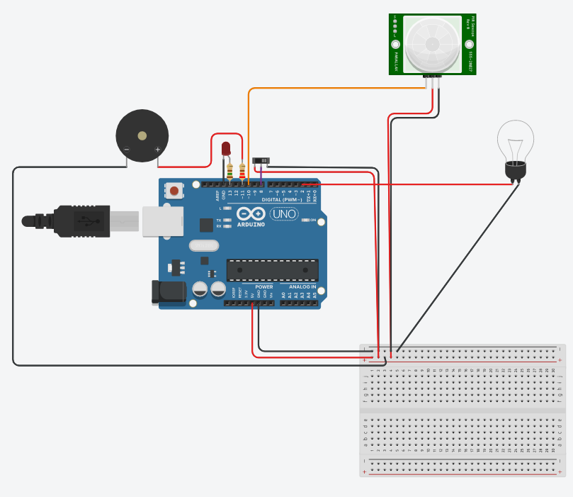
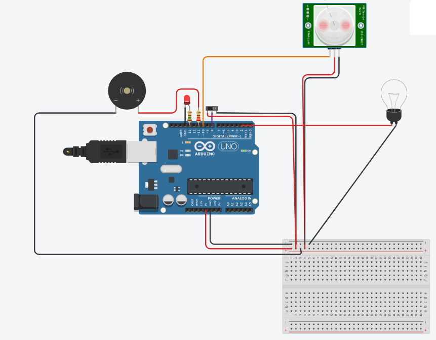
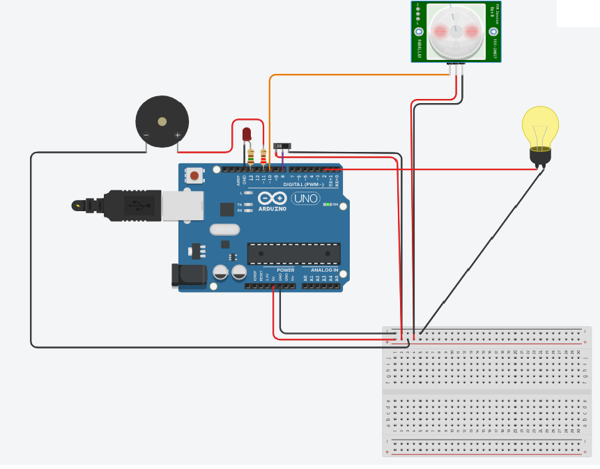

# Ciruito_IOT
Um circuito Arduino para utilizar um detector de presença, podendo ser usado para segurança, e tambem para ativar a luz utilizando um switch.

Monte o circuito dessa forma:

E em programação de blocos faça

Desta forma, quando o switch estiver para direita, ele estará no modo segurança, e assim que detectar um movimento, irá ativar o led e o buzzer, até que o switch seja movido para a esquerda.

E quando o switch estiver para esquerda, estará no modo luz automatica, que assim que detectar movimento fica acessa por alguns segundos.

